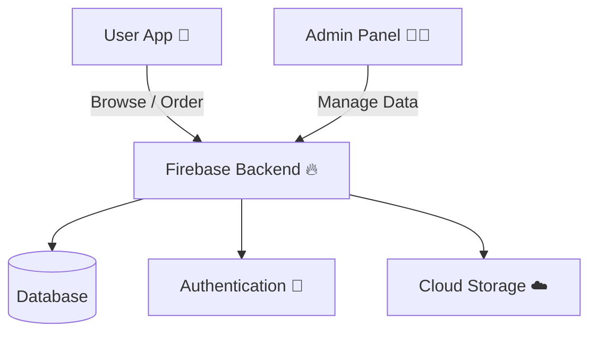
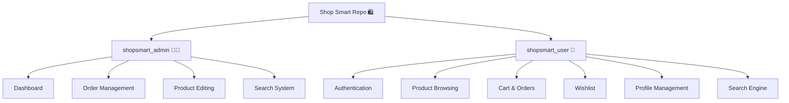
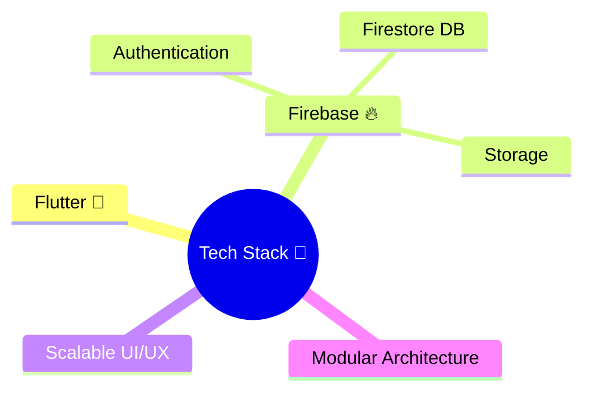

### *Where seamless shopping meets smart architecture*

> A dual-interface Flutter application engineered for **efficiency, scalability, and delightful UX** — serving both **Admins** and **Users** in one cohesive ecosystem.

---

## 🌐 Overview

**Shop Smart** is not just an app—it's a system.
Two interfaces. One vision. Zero chaos.

* 🧑‍💼 Admins manage the platform effortlessly
* 🛒 Users enjoy a frictionless shopping experience
* ⚡ Built with performance-first Flutter architecture

---

## 🧭 System Architecture



---

## 📁 Project Structure



---

## 🧑‍💼 Admin Panel (`shopsmart_admin`)

> Control. Visibility. Efficiency.

✨ Features:

* 📊 **User Dashboard** — monitor activity like a boss
* 📦 **Order Management** — track, update, fulfill
* 🛠️ **Product Editing** — real-time updates
* 🔍 **Search Functionality** — find anything instantly

---

## 🛒 User Application (`shopsmart_user`)

> Smooth. Personal. Addictive (in a good way).

✨ Features:

* 🔐 **Authentication System**

  * Login / Register / Forgot Password
* 🛍️ **Product Exploration**

  * Detailed views, intuitive UI
* 🛒 **Cart & Orders**

  * Seamless checkout flow
* ❤️ **Wishlist & Recently Viewed**

  * Memory that never forgets
* 👤 **Profile Management**

  * Full user control
* 🔎 **Advanced Search**

  * Fast, responsive, relevant

---

## ⚙️ Tech Stack



* **Flutter** → Cross-platform UI magic
* **Firebase** → Backend power (optional integration-ready)

---

## 🚀 Getting Started

```bash
# Clone the repository
git clone https://github.com/your-username/shopsmart.git

# Navigate into project
cd shopsmart

# Run Admin Panel
cd shopsmart_admin
flutter pub get
flutter run

# Run User App
cd ../shopsmart_user
flutter pub get
flutter run
```

---

## 🤝 Contribution

Let’s build something bigger than code—let’s build impact.

💡 Want to:

* Integrate **Firebase backend**?
* Optimize performance?
* Add new features?

📧 Reach out: **[mosamanoor17@gmail.com](mailto:mosamanoor17@gmail.com)**

---

## 🔐 License

📌 Open for:

* Learning
* Personal projects

🚫 For commercial use → **Permission required via email**

---

## 🌟 Final Note

This project isn’t just about shopping
it’s about crafting a **scalable digital experience** with clean architecture and user-first thinking.

> Build smart. Ship fast. Stay elegant.

---
